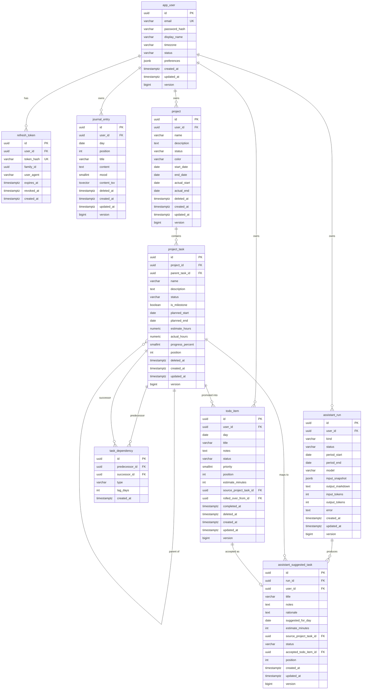

# Kairon — Data Model

Status: **Draft**. Companion to [`DESIGN.md`](DESIGN.md).

Conventions:

- Primary keys are **UUID** (UUIDv7, time-ordered), column `id`.
- Every business row has `created_at timestamptz`, `updated_at timestamptz`, and
  `version bigint` (JPA optimistic locking).
- Every user-owned row has `user_id uuid not null references app_user(id)`.
- Soft delete: `deleted_at timestamptz null` on entities that mobile will sync
  (todo items, journal entries, projects, project tasks). Queries filter it out.
- The `assistant` module's tables (`assistant_run`, `assistant_suggested_task`)
  are **not** mobile-synced and carry **no soft delete**: a run is regenerable
  and is hard-deleted when the user removes it (which is also how stored
  prompt/journal excerpts are purged).
- Enums are stored as `varchar` with a `check` constraint, mapped in JPA with
  `@Enumerated(EnumType.STRING)`.
- `day` columns are `date` (no time); interpreted in the owning user's timezone.

---

## ER diagram



---

## Tables

### `app_user`  (module: identity)

| Column | Type | Notes |
| --- | --- | --- |
| `id` | uuid PK | |
| `email` | varchar(320) | **unique**, stored lower-cased |
| `password_hash` | varchar(255) | Argon2id (`{argon2}...` prefixed) |
| `display_name` | varchar(80) | |
| `timezone` | varchar(64) | IANA zone, e.g. `Europe/Amsterdam`; default `UTC` |
| `status` | varchar | `ACTIVE` \| `PENDING` \| `DISABLED` |
| `preferences` | jsonb | UI prefs (theme, default landing screen); schema-less |
| `created_at`,`updated_at` | timestamptz | |
| `version` | bigint | |

Indexes: `unique(email)`.

### `refresh_token`  (module: identity)

| Column | Type | Notes |
| --- | --- | --- |
| `id` | uuid PK | |
| `user_id` | uuid FK → app_user | |
| `token_hash` | varchar(64) | SHA-256 of the opaque token; **unique** |
| `family_id` | uuid | rotation family; reuse of a revoked token revokes the family |
| `user_agent` | varchar(255) | device hint |
| `expires_at` | timestamptz | |
| `revoked_at` | timestamptz null | |
| `created_at` | timestamptz | |

Indexes: `unique(token_hash)`, `index(user_id)`, `index(family_id)`.
A cleanup `CronJob` (or a scheduled task) deletes rows past `expires_at`.

### `todo_item`  (module: todo)

| Column | Type | Notes |
| --- | --- | --- |
| `id` | uuid PK | |
| `user_id` | uuid FK → app_user | |
| `day` | date | the list this item lives on |
| `title` | varchar(500) | |
| `notes` | text null | markdown |
| `status` | varchar | `OPEN` \| `DONE` \| `CANCELLED` |
| `priority` | smallint | 0 = none, 1 = low … 3 = high |
| `position` | int | order within `(user_id, day)`; sparse (100, 200, …) for cheap reorder |
| `estimate_minutes` | int null | |
| `source_project_task_id` | uuid FK → project_task, null | set when promoted from a project |
| `rolled_over_from_id` | uuid FK → todo_item, null | previous day's item this one carries |
| `completed_at` | timestamptz null | |
| `deleted_at` | timestamptz null | |
| `created_at`,`updated_at`,`version` | | |

Indexes: `index(user_id, day)`, `index(source_project_task_id)`.

**Rollover** (`POST /todo:rollover`): for each selected `OPEN` item on `fromDay`,
insert a new row on `toDay` with the same content, `rolled_over_from_id = old.id`,
and mark the old item `status = CANCELLED` (or keep it `OPEN` and just copy —
decision: **cancel the old, create the new**, so each day's list reflects intent
for that day and the chain is traceable). Alternative "move the row's `day`
forward" is rejected because it loses history.

### `journal_entry`  (module: journal)

| Column | Type | Notes |
| --- | --- | --- |
| `id` | uuid PK | |
| `user_id` | uuid FK → app_user | |
| `day` | date | |
| `position` | int | order within `(user_id, day)` when there are multiple |
| `title` | varchar(200) null | |
| `content` | text | markdown |
| `mood` | smallint null | 1–5 scale, optional |
| `content_tsv` | tsvector | generated: `to_tsvector('simple', coalesce(title,'') || ' ' || content)` |
| `deleted_at` | timestamptz null | |
| `created_at`,`updated_at`,`version` | | |

Indexes: `index(user_id, day)`, **GIN** `index(content_tsv)` for search.
`GET /journal:search?q=` uses `content_tsv @@ websearch_to_tsquery('simple', :q)`
ranked by `ts_rank`.

### `project`  (module: projects)

| Column | Type | Notes |
| --- | --- | --- |
| `id` | uuid PK | |
| `user_id` | uuid FK → app_user | |
| `name` | varchar(200) | |
| `description` | text null | markdown |
| `status` | varchar | `PLANNING` \| `ACTIVE` \| `ON_HOLD` \| `DONE` \| `ARCHIVED` |
| `color` | varchar(7) | hex, for Gantt/badges |
| `start_date`,`end_date` | date null | planned window |
| `actual_start`,`actual_end` | date null | filled as work happens |
| `deleted_at` | timestamptz null | |
| `created_at`,`updated_at`,`version` | | |

Indexes: `index(user_id, status)`.

### `project_task`  (module: projects)

| Column | Type | Notes |
| --- | --- | --- |
| `id` | uuid PK | |
| `project_id` | uuid FK → project | |
| `parent_task_id` | uuid FK → project_task, null | ≤ 2 levels deep enforced in the service |
| `name` | varchar(300) | |
| `description` | text null | |
| `status` | varchar | `TODO` \| `IN_PROGRESS` \| `BLOCKED` \| `DONE` |
| `is_milestone` | boolean | default false; true ⇒ `planned_start == planned_end` |
| `planned_start`,`planned_end` | date null | |
| `estimate_hours` | numeric(6,2) null | |
| `actual_hours` | numeric(6,2) null | |
| `progress_percent` | smallint | 0–100, default 0 |
| `position` | int | order within project (and within a parent) |
| `deleted_at` | timestamptz null | |
| `created_at`,`updated_at`,`version` | | |

Indexes: `index(project_id)`, `index(parent_task_id)`.
Deleting a project cascades (soft) to its tasks and their dependencies.

### `task_dependency`  (module: projects)

| Column | Type | Notes |
| --- | --- | --- |
| `id` | uuid PK | |
| `predecessor_id` | uuid FK → project_task | |
| `successor_id` | uuid FK → project_task | |
| `type` | varchar | `FS` (default) \| `SS` \| `FF` \| `SF` |
| `lag_days` | int | may be negative (lead); default 0 |
| `created_at` | timestamptz | |

Constraints: `unique(predecessor_id, successor_id)`, `check(predecessor_id <>
successor_id)`, both tasks must belong to the same project (service-enforced).
The service rejects a new edge that would create a **cycle** (DFS on the
dependency graph).

### `assistant_run`  (module: assistant)

| Column | Type | Notes |
| --- | --- | --- |
| `id` | uuid PK | |
| `user_id` | uuid FK → app_user | |
| `kind` | varchar | `TODO_SUGGESTION` \| `WEEKLY_SUMMARY` \| `MONTHLY_SUMMARY` \| `JOURNAL_REFLECTION` |
| `status` | varchar | `PENDING` \| `RUNNING` \| `SUCCEEDED` \| `FAILED` |
| `period_start`,`period_end` | date null | the window the run plans for / summarises |
| `model` | varchar | model id actually used, e.g. `claude-sonnet-5` |
| `input_snapshot` | jsonb | exactly what context was gathered and sent, for user audit |
| `output_markdown` | text null | the assistant's narrative result |
| `input_tokens`,`output_tokens` | int null | from the API response, for cost visibility |
| `error` | text null | RFC 7807 detail when `status = FAILED` |
| `created_at`,`updated_at`,`version` | | |

Indexes: `index(user_id, kind, created_at)`.
No soft delete: a `DELETE` is a hard delete and purges the stored snapshot.
Summaries and reflection are produced by a background job (`@Async`, plus a
`@Scheduled` auto-trigger for summaries); todo-suggestion runs usually complete
within the request. A **per-user monthly token budget** is enforced by summing
`input_tokens + output_tokens` over the calendar month before a new run starts.

### `assistant_suggested_task`  (module: assistant)

| Column | Type | Notes |
| --- | --- | --- |
| `id` | uuid PK | |
| `run_id` | uuid FK → assistant_run | the `TODO_SUGGESTION` run that produced it |
| `user_id` | uuid FK → app_user | denormalised for scoping |
| `title` | varchar(500) | |
| `notes` | text null | markdown |
| `rationale` | text null | why the assistant proposed it (which project / journal cue) |
| `suggested_for_day` | date null | |
| `estimate_minutes` | int null | |
| `source_project_task_id` | uuid FK → project_task, null | set when it maps to an existing task |
| `status` | varchar | `PROPOSED` \| `ACCEPTED` \| `DISMISSED` |
| `accepted_todo_item_id` | uuid FK → todo_item, null | set on accept; the created todo item |
| `position` | int | order within the run |
| `created_at`,`updated_at`,`version` | | |

Indexes: `index(run_id)`, `index(user_id, status)`.
**Accept** (`POST /assistant/suggested-tasks/{id}:accept`): create a `todo_item`
for the target day (carrying `source_project_task_id` when present), then set
`status = ACCEPTED` and `accepted_todo_item_id`. The assistant never writes a
`todo_item` itself — accept is always a user action.

### Per-user assistant settings

No table: stored in `app_user.preferences` (jsonb), e.g.

```json
"assistant": {
  "todoSuggestions":    { "enabled": false },
  "executionSummaries": { "enabled": false },
  "journalReflection":  { "enabled": false },
  "modelOverride": null,
  "tone": "balanced"
}
```

All three feature flags default off and are toggled independently, so a user can
enable planning help without enabling journal reflection.

---

## Not in the first cut (schema stubs to add later)

- **Tags** — `tag(id, user_id, name, color)` plus per-entity join tables
  (`todo_item_tag`, `journal_entry_tag`, `project_task_tag`). Deferred to keep
  MVP small.
- **Attachments** — `attachment(id, user_id, owner_type, owner_id, blob_key,
  filename, content_type, size)`; needs object storage.
- **Journal revisions** — `journal_entry_revision(id, entry_id, content,
  created_at)`.
- **Recurring todos** — `todo_template(id, user_id, rrule, title, …)` + a
  scheduler that materialises items per day.
- **Reminders / notifications** — `device_token`, `reminder`, a scheduler, and
  APNs/FCM integration.
- **Sync bookkeeping** — a per-user `sync_cursor` / server-change-log table if
  the `since=` scan on `updated_at` proves too coarse.

---

## Migration plan (Flyway)

Versioned SQL under `backend/src/main/resources/db/migration/`. Rough order,
tracking the roadmap:

| Version | Contents |
| --- | --- |
| `V001__identity.sql` | `app_user` (M0); `refresh_token` appended in M1 |
| `V002__todo.sql` | `todo_item` |
| `V003__journal.sql` | `journal_entry` + `content_tsv` + GIN index |
| `V004__projects.sql` | `project`, `project_task` |
| `V005__task_dependencies.sql` | `task_dependency` |
| `V006__planning_links.sql` | any indexes needed by the "Today" aggregation |
| `V007__assistant.sql` | `assistant_run`, `assistant_suggested_task` |
| `V0xx__…` | tags, attachments, recurrence, etc. as they land |

Repeatable migrations (`R__…`) only for views/functions if introduced.
