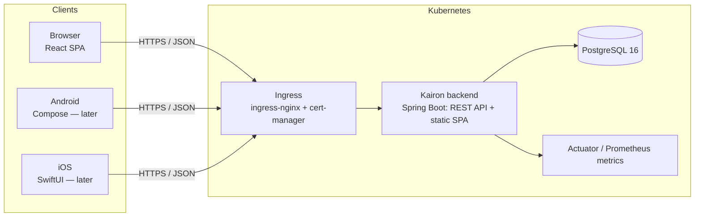
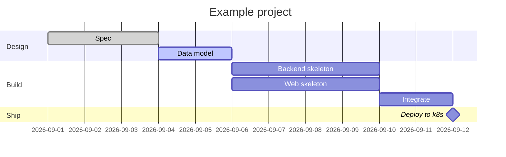

# Kairon — Design

Status: **Draft**. Last updated: 2026-08-28.

This document describes the architecture and design of Kairon. It is the
companion to [`DATA_MODEL.md`](DATA_MODEL.md) (schema detail) and
[`ROADMAP.md`](ROADMAP.md) (delivery order).

---

## 1. Goals and non-goals

### Goals

- A **single deployable system** that runs one person's day: daily todos, a daily
  journal, and small personal projects with a Gantt chart.
- **API-first.** The backend is the source of truth. Web today; native mobile
  later; both are just clients.
- **Multi-user from day one.** Registration + login, with every row owned by a
  user. It is a personal tool, but "personal" should not mean "single hard-coded
  account" — friends and family should be able to self-host-share one instance.
- **Cloud-native deployment** as a first-class concern: Docker images, a Helm
  chart, runs on Kubernetes locally (kind/minikube) and in a managed cluster.
- **Low ceremony.** No sprints, boards-with-swimlanes, workflow engines, or
  role systems. Estimates, dates, dependencies, done/not-done.
- **Optional AI assistance.** A later phase adds an assistant (Anthropic API)
  that suggests todo lists, writes weekly/monthly execution summaries, and
  reflects on the weekly journal. It is opt-in per feature, off by default, and
  never on the critical path — Kairon runs fully without it. See §13.

### Non-goals (for now)

- Real-time collaboration, comments, mentions, shared editing.
- Assignees, teams, permissions beyond "this is mine".
- Time tracking / billing, resource levelling, portfolio management.
- A plugin system or public API for third parties.
- Offline-first web. (Mobile will need an offline story; the web app assumes
  connectivity for the first releases.)
- AI that writes to your data on its own. The assistant only ever *proposes*;
  creating a todo, journal entry, or project from a suggestion is always an
  explicit user action.

---

## 2. Product shape

### 2.1 Daily Todo

- A **todo item** belongs to one `day` (a calendar date) and one user.
- Fields: title, optional notes (markdown), status (`OPEN` / `DONE` / `CANCELLED`),
  priority, an ordering position within the day, optional time estimate.
- **Rollover**: at day boundary (or on demand) the user pulls unfinished items
  from a previous day into today. Each carried item records where it came from
  (`rolled_over_from_id`) so a chain of procrastination is visible.
- A todo item may be **linked to a project task** (`source_project_task_id`).
  This is how a project task becomes "today's work".
- Interactions are keyboard-first: add on Enter, complete with a shortcut,
  drag or keyboard to reorder.

### 2.2 Daily Journal

- A **journal entry** belongs to one `day` and one user. Multiple entries per day
  are allowed (a morning plan and an evening reflection), ordered within the day.
- Fields: optional title, markdown `content`, optional `mood` (small integer
  scale), timestamps.
- Navigation: a calendar popover (`shadcn` `Calendar`) with a dot on days that
  have an entry, alongside the same `‹ › Today` controls as the Todo day view;
  "today" is the default.
- The entry is edited through a minimal **WYSIWYG** editor (Tiptap: bold,
  italic, one heading level) — raw markdown syntax is never shown to the user,
  though `content` stays plain markdown text on the wire and in storage.
- **Search** across entry text (Postgres full-text search; see Data Model),
  returning ranked, paginated hits with a highlighted snippet.
- Entry history/revisions is a later enhancement, not in the first cut.

### 2.3 Projects

A **project** is a small, self-contained effort with a planned window.

- Projects can be grouped under a user-managed **category** (`project_category`)
  — an "epic"-like label with just a name, a colour, and a user-chosen display
  order (not alphabetical: a catch-all like "Miscellaneous" can sit first).
  Optional; a project without one is uncategorized.
- A project can carry a **t-shirt size** (`XS`–`XL`) — a rough, optional
  at-a-glance sense of scope, distinct from `estimate_hours` on its tasks
  (which is a real number, per task, once the work is broken down).
- A project also carries a **priority rank** — a manual, drag-ordered
  ranking across all of a user's (non-archived) projects, not a severity
  scale like `todo_item.priority`. Sorting the project list by priority
  switches to a single flat, cross-category, drag-reorderable list, the
  same interaction as Todo's day reorder.
- Project fields: category (optional), size (optional), priority rank, name, description, status
  (`PLANNING` / `ACTIVE` / `ON_HOLD` / `DONE` / `ARCHIVED`), colour, planned
  `start_date` / `end_date`, actual start/end, timestamps.
- A project has **tasks** (`project_task`):
  - name, description, status (`TODO` / `IN_PROGRESS` / `BLOCKED` / `DONE`),
  - `planned_start` / `planned_end`, `estimate_hours`, `actual_hours`,
    `progress_percent`,
  - `parent_task_id` for a one- or two-level breakdown (summary task → subtasks),
  - `is_milestone` flag (a milestone is a zero-duration task rendered as a
    diamond),
  - ordering position.
- Tasks can have **dependencies** (`task_dependency`): predecessor → successor,
  a `type` (`FS` finish-to-start is the default; `SS`, `FF`, `SF` supported in
  the model), and an optional `lag_days`.
- The **Gantt chart** renders tasks on a timeline with dependency arrows, a
  "today" line, and progress bars. See §7.

### 2.4 Today

Not its own storage — a **query** and a screen:

- today's todo items,
- project tasks whose `[planned_start, planned_end]` window contains today, or
  that are overdue and not done,
- a prompt to write today's journal entry.

From this screen the user can **promote a project task into today's todo list**
(creates a todo item linked back to the task).

### 2.5 AI assistant (later)

A later phase (§13) adds an optional assistant: it suggests a day's or week's
todos from active projects and recent activity, writes weekly/monthly execution
summaries with efficiency suggestions, and reflects on the weekly journal. It is
opt-in per feature and off by default; the rest of Kairon does not depend on it.

---

## 3. Architecture overview



The browser downloads the React SPA **from the backend itself** — the Vite build
output is packaged into the Spring Boot jar and served as static resources. There
is no separate web server or web container. See §3.3 and §8.1.

### 3.1 Backend: a modular monolith

One Spring Boot application, internally split into **feature modules** with
enforced boundaries. Rationale in [`adr/0001-architecture-and-stack.md`](adr/0001-architecture-and-stack.md).

- **Package-by-feature.** Top-level packages under `com.kairon`:
  - `common` — shared kernel: error handling, security plumbing, base types,
    config, `UserId` value type. No feature logic.
  - `identity` — users, registration, login, tokens.
  - `todo` — daily todo items and rollover.
  - `journal` — journal entries and search.
  - `projects` — projects, tasks, dependencies, schedule/Gantt computation.
  - `planning` — the "Today" aggregation. Reads from `todo` and `projects`
    through their public APIs only.
  - `assistant` — optional AI features (todo suggestions, execution summaries,
    journal reflection). Reads `todo`, `journal`, `projects`, and `planning`
    through their public `api` packages only, and is the **only** module that
    talks to the Anthropic API. Later phase (M8–M10); see §13.
- **Module contract.** Each module exposes a thin `api` sub-package (public
  services + DTOs). Other modules depend on that, never on another module's
  `domain` or `repo` packages. Enforced by an **ArchUnit** test in CI. A second
  ArchUnit rule asserts that only `assistant` imports the Anthropic SDK, keeping
  the third-party dependency contained to one module.
- **Persistence per module.** Each module owns its tables and its Flyway
  migrations live in one shared `db/migration` folder with a module prefix in
  the description (`V007__todo_add_estimate.sql`).
- If a module ever needs to become a separate service, the seam already exists.
  Not planned.

### 3.2 Request flow

`Controller (DTO, validation)` → `Application service (transaction, authz: row
belongs to current user)` → `Domain service / entities` → `Spring Data
repository` → PostgreSQL. MapStruct maps DTO ↔ entity. Responses are DTOs, never
entities.

### 3.3 Serving the web app from the backend

The `web/` module stays a self-contained React/Vite codebase with its own
`package.json`, but it is **not deployed separately**. Its production build is
embedded in the Spring Boot jar for a single deployable.

- **Build wiring.** The Gradle build has two subprojects, `:backend` and `:web`.
  `:web` uses the `com.github.node-gradle.node` plugin to run `npm ci` +
  `npm run build`; its `dist/` is wired into `:backend`'s `processResources` and
  copied to `META-INF/resources/` (or `static/`) on the classpath. `:backend`
  cannot be packaged without an up-to-date web build.
- **SPA fallback.** A `WebMvcConfigurer` registers a `PathResourceResolver` that
  serves `index.html` for any GET that is not a real static file and does **not**
  start with `/api/` or `/actuator/` — so client-side routes like
  `/journal/2026-08-28` load the app instead of 404ing. API 404/401 responses are
  untouched.
- **Caching.** Vite emits content-hashed asset filenames, served
  `Cache-Control: public, max-age=31536000, immutable`; `index.html` is served
  `no-cache` so a deploy is picked up immediately.
- **Security.** Spring Security permits `/`, `/index.html`, `/assets/**`,
  `/favicon.ico`, and the SPA fallback anonymously; everything under `/api/**`
  keeps the bearer-token filter.
- **Config.** The SPA calls the API at the relative path `/api/v1` — same origin,
  so no build-time or run-time API URL configuration is needed in any
  environment. The whole app (SPA, API, actuator) is mounted under the fixed
  `/kairon` context path (`server.servlet.context-path`, matched by the Vite
  `base` and the Helm chart's `ingress.path`) so a host can serve several
  personal apps side by side under one origin.
- **Reversibility.** Because `web/` is already isolated, splitting it back out to
  its own nginx image later is a build-config change, not a rewrite.

---

## 4. Technology choices

| Concern | Choice | Notes |
| --- | --- | --- |
| Language / runtime | **Java 25** (LTS) | Records, pattern matching, virtual threads, scoped values; latest LTS. |
| Framework | **Spring Boot 4** (Spring Framework 7), Spring MVC | REST controllers; virtual-thread executor enabled. Jackson 3 baseline; JSpecify null-safety; built-in API versioning available. |
| Build | **Gradle**, Kotlin DSL | Root build with `:backend` and `:web` subprojects; `:web` (node-gradle plugin) builds the SPA into `:backend`'s resources. Version catalog. |
| Web packaging | **Embedded in the Spring Boot jar** | Vite `dist/` served as static resources with SPA fallback; no nginx, no separate web container/image. See §3.3. |
| Persistence | **Spring Data JPA / Hibernate ORM 7**, **PostgreSQL 16** | |
| Migrations | **Flyway** | Versioned SQL, run as a Helm pre-upgrade hook Job (see §8). |
| API docs | **springdoc-openapi** | Serves `/v3/api-docs`; the OpenAPI spec is the client-generation source. |
| Security | **Spring Security 7** (ships with Spring Boot 4), JWT | Access + refresh tokens; Argon2 password hashing. See §6. |
| Validation | Jakarta Bean Validation | On request DTOs. |
| Mapping | **MapStruct** | Compile-time DTO/entity mappers. |
| Errors | **RFC 7807** `application/problem+json` | One `@RestControllerAdvice`. |
| AI assistant (later) | **Anthropic Java SDK** (`com.anthropic:anthropic-java`) | Server-side only; default model `claude-sonnet-5`, configurable. Prompt caching + structured outputs. Only the `assistant` module depends on it (ArchUnit-enforced). See §13. |
| Scheduled jobs | Spring **`@Scheduled`** / **`@Async`** | Auto-generated weekly/monthly summaries for opted-in users; refresh-token cleanup. |
| Rate limiting | **Bucket4j** | Auth endpoints; `/assistant/**`. |
| Backend tests | JUnit 5, AssertJ, **Testcontainers** (Postgres), MockMvc, **ArchUnit** | |
| Frontend | **React 18 + TypeScript + Vite** | |
| Routing | **React Router** | |
| Server state | **TanStack Query** | Caching, refetch, optimistic updates. |
| Client state | **Zustand** | Small: auth session, UI prefs. |
| Forms | **React Hook Form + Zod** | Zod schemas shared with API client types where possible. |
| UI kit | **Tailwind CSS + shadcn/ui** (Radix primitives) | Own the components, no heavy dependency. |
| Gantt | **`gantt-task-react`** (MIT) for MVP | Replace with custom SVG/visx if it limits us. Avoid GPL/commercial Gantt libs (dhtmlx). |
| Journal editor | **Tiptap** (`@tiptap/react` + `@tiptap/starter-kit`, a small extension subset) + `tiptap-markdown` | WYSIWYG only — bold/italic/one heading level, no raw-markdown mode; serializes to/from plain markdown text so `content` stays unchanged on the wire (docs/milestones/M3 D1). |
| Date calendar | **`react-day-picker`** (via shadcn's `Calendar`) | Backs the journal date nav's has-entry popover; bridges to the project's own `YYYY-MM-DD` string helpers, no added date library (docs/milestones/M3 D2). |
| API client | **`openapi-typescript`** for types + a generated fetch client (**orval**) | Regenerated from the backend spec in CI. |
| Frontend tests | **Vitest** + React Testing Library, **MSW** for API mocks, **Playwright** e2e | |
| Container | **Docker**, one image, multi-stage (node → gradle → `eclipse-temurin:25-jre`) | |
| Orchestration | **Kubernetes** + **Helm 3** | |
| DB on k8s | Bitnami **PostgreSQL** subchart (dev); **CloudNativePG** operator (prod) | |
| Ingress / TLS | **ingress-nginx** + **cert-manager** | |
| CI/CD | **GitHub Actions**, one image to **GHCR**, **Trivy** scan, **Renovate** | |
| Observability | Actuator health groups, **Micrometer → Prometheus**, JSON logs (Spring Boot built-in structured logging, ECS format), correlation-id filter | |

---

## 5. API design

- Base path **`/api/v1`**. Version in the path; breaking changes bump the version.
  (Spring Framework 7's built-in API versioning is available if header- or
  media-type-based negotiation is ever preferred; path versioning is kept for
  simplicity and cache/log legibility.)
- JSON only. `application/problem+json` for errors.
- **Auth**: `Authorization: Bearer <access token>` on every call except
  `/auth/*` and `/actuator/health`.
- **Lists** use `page` / `size` / `sort` (Spring `Pageable`) and return a
  `{ content, page, totalElements }` envelope. Date-range endpoints take
  `from` / `to` ISO dates. **Exception:** a fully-ordered, un-paginated
  collection with a natural bound returns a **bare array** — `GET /todo?day=`
  and `GET /todo?from=&to=` do this (a day's list is small and has no pagination
  need; see docs/milestones/M2-daily-todo.md §5).
- **IDs are UUIDv7** (time-ordered). Clients may generate IDs — needed for
  offline mobile creation later and safe for idempotent `PUT`.
- **Optimistic concurrency**: entities carry a `version`; update DTOs echo it;
  mismatch → `409`.
- Timestamps are UTC ISO-8601. A "day" is a `LocalDate` in the user's timezone
  (stored on the user profile).

### 5.1 Endpoint sketch

| Area | Endpoints |
| --- | --- |
| Auth | `POST /auth/register`, `POST /auth/login`, `POST /auth/refresh`, `POST /auth/logout`, `POST /auth/logout-all` |
| Profile | `GET /me`, `PATCH /me` (display name, timezone, preferences incl. `assistant.*` per-feature opt-ins) |
| Todo | `GET /todo?day=`, `GET /todo?from=&to=` (both bare arrays), `POST /todo`, `PATCH /todo/{id}`, `DELETE /todo/{id}`, `POST /todo/{id}:complete` (`{complete?}`), `POST /todo:reorder` (`{day, orderedIds}`), `GET /todo/rollover-preview?onDay=` → `{ sourceDays: [{ day, items }], totalItems }`, `POST /todo:rollover` (`{toDay, fromDay?, ids?}` — omit both to sweep the whole look-back window), `POST /todo:rollover-undo` (`{createdIds}`) |
| Journal | `GET /journal?day=`, `GET /journal?from=&to=` (both bare arrays), `GET /journal/entry-days?from=&to=` → `string[]` of ISO dates with ≥1 entry (calendar markers), `POST /journal`, `PATCH /journal/{id}`, `DELETE /journal/{id}`, `GET /journal:search?q=&page=&size=` → paginated `{ content: [{id, day, title, snippet, mood, createdAt}], page, totalElements }`, ranked by `ts_rank` with a `ts_headline` snippet per hit (no standalone `GET /journal/{id}` — a search hit navigates to its day, docs/milestones/M3 §9 Q1) |
| Project categories | `GET /project-categories`, `POST /project-categories`, `PATCH /project-categories/{id}`, `DELETE /project-categories/{id}`, `POST /project-categories:reorder` (`{orderedIds}`) |
| Projects | `GET /projects` (`status?`, `categoryId?`, `size?`, `page?`, `pageSize?`, `sort?`), `GET /projects/priority-ordered` (flat, `priority_rank` order, every non-archived project), `POST /projects`, `GET /projects/{id}`, `PATCH /projects/{id}` (whole-form save, excludes `priority_rank` — M4 D15/D18), `DELETE /projects/{id}` (cascades a soft-delete to its tasks), `POST /projects:reorder` (`{orderedIds}` — rewrites `priority_rank` across the user's non-archived projects) |
| Project tasks | `GET /projects/{id}/tasks`, `POST /projects/{id}/tasks`, `PATCH /tasks/{taskId}` (whole-form save, incl. `parentTaskId` for reparenting — `null` moves a task back to top-level; M4 D5/D15), `DELETE /tasks/{taskId}`, `POST /projects/{id}/tasks:reorder` (`{parentTaskId?, orderedIds}`, scoped to that sibling group) |
| Dependencies | `GET /projects/{id}/dependencies` → edges with a computed `violatesConstraint` flag, `POST /tasks/{taskId}/dependencies`, `DELETE /dependencies/{depId}` (M5 D7 — no combined `/gantt` endpoint; the Gantt tab composes this with the already-fetched project/task list, see `docs/milestones/M5-gantt-dependencies.md` §5) |
| Planning | `GET /planning/today?date=` → `{ todos, dueProjectTasks, journalPrompt }`; `POST /planning/today:promote` (`{projectTaskId, day}`) → new todo item |
| Assistant (later) | `POST /assistant/todo-suggestions` (`{day, horizon}`), `POST /assistant/summaries` (`{period: WEEK\|MONTH, date}`), `POST /assistant/journal-reflection` (`{weekOf}`) → each creates an `assistant_run`; `GET /assistant/runs/{id}`, `GET /assistant/runs?kind=&from=&to=`, `DELETE /assistant/runs/{id}`; `POST /assistant/suggested-tasks/{id}:accept` (→ new todo item), `POST /assistant/suggested-tasks/{id}:dismiss` |

(`:verb` sub-resources are used for actions that are not plain CRUD.)

### 5.2 Client generation

The backend's OpenAPI document is committed as an artifact in CI. From it:

- **web**: TypeScript types + a typed fetch client (regenerated on spec change).
- **android** (later): OpenAPI Generator → Kotlin + Retrofit/Ktor client.
- **ios** (later): OpenAPI Generator → Swift client, or hand-written with
  generated models.

---

## 6. Authentication & security

- **Registration**: email + password + display name. Email is the login
  identifier, stored case-folded and unique. Optional email verification is a
  later enhancement (a `status` column already allows `PENDING`).
- **Password hashing**: Spring Security `DelegatingPasswordEncoder` with
  **Argon2id** as the default; bcrypt accepted for legacy/import.
- **Tokens**:
  - **Access token** — JWT, ~15 min TTL, signed (HS256 with a rotated secret, or
    RS256 with a keypair if we later split services). Carries `sub` (user id),
    `iss`, `iat`, `exp`. Stateless validation via Spring Security's Nimbus
    resource-server filter. The configured secret (`kairon.security.jwt.secret`,
    from `KAIRON_JWT_SECRET`) is hashed with SHA-256 to derive the 256-bit MAC
    key, so any secret of reasonable entropy works without a length constraint.
  - **Refresh token** — opaque random string, ~30 day TTL, **stored hashed** in
    `refresh_token` with device/user-agent metadata. **Rotated on every use**;
    the old one is revoked; reuse of a revoked token revokes the whole family
    (theft detection). `logout` revokes one; `logout-all` revokes all for the
    user.
- **Token storage in the web app**: access token in memory only; refresh token
  in an **httpOnly, Secure, SameSite=Strict cookie** scoped to `/api/v1/auth`
  (a genuine first-party cookie, since the SPA is served from the backend
  origin). This keeps tokens out of `localStorage` (XSS) and needs no CSRF token because
  the refresh endpoint is the only cookie-authenticated route and is
  `SameSite=Strict`. All other endpoints are pure `Authorization` header, so
  CSRF is disabled globally in Spring Security.
- **Mobile** uses the platform secure store (Keystore / Keychain) for the
  refresh token; same rotation rules.
- **Transport**: HTTPS only, HSTS, TLS terminated at ingress (cert-manager).
- **Rate limiting**: Bucket4j on `/auth/login`, `/auth/register`,
  `/auth/refresh` (per IP + per account).
- **CORS**: not needed for the web app — it is served from the backend's own
  origin (and in dev the Vite proxy keeps it same-origin). CORS stays disabled
  unless a separate first-party client origin is ever introduced; native mobile
  apps are not subject to it.
- **Authorization**: every query is scoped by `userId` from the token. A
  `@CurrentUser` argument resolver injects it; services filter and 404 (not 403)
  on someone else's row to avoid leaking existence.
- **Supply chain**: Renovate for dependency PRs, Trivy image scan in CI,
  `gradle --write-verification-metadata` optional.
- **Backups**: a `CronJob` runs `pg_dump` to object storage; restore procedure
  documented in `deploy/`.

---

## 7. Projects, scheduling, and the Gantt chart

### 7.1 MVP — render what the user enters

- The user sets `planned_start` / `planned_end` on each task explicitly.
- `GET /projects/{id}/dependencies` returns the dependency edges (each with a
  computed `violatesConstraint`); the Gantt tab composes them with the task
  list and project window already fetched for the Tree/Board tabs — no
  combined endpoint (M5 D7, a deviation from an earlier sketch of this
  section; "today" is computed client-side, M5 D8).
- The web app renders bars, milestone diamonds, dependency arrows, a today line,
  and progress fill from `progress_percent`.
- Editing a bar (drag ends / move) issues `PATCH /tasks/{id}`.
- **Validation**: a warning (not a hard error) when a task starts before a
  finish-to-start predecessor ends. The user stays in control.

### 7.2 Phase 2 — assisted scheduling (enhancement, not MVP)

- Given a project start date, task durations (from `estimate_hours` and a
  working-day calendar), and `FS` dependencies with lag, compute a **forward
  pass**: earliest start / earliest finish per task.
- Optional **critical path** = the longest dependency chain; highlight it.
- "Reschedule from today" and "shift project by N days" bulk operations.
- Kept server-side (`projects` module, a `ScheduleService`) so every client
  gets the same numbers.

### 7.3 Example (illustrative)



---

## 8. Deployment

### 8.1 Image (`docker/`)

One image — **`Dockerfile`** — multi-stage:

1. `node:22` — `npm ci && npm run build` in `web/`, producing `dist/`.
2. `gradle:jdk25` — copies `web/dist` into the backend resources, runs
   `./gradlew :backend:bootJar` to build a layered jar.
3. `eclipse-temurin:25-jre` — runtime only. Non-root user, `EXPOSE 8080`, health
   via Actuator.

The jar contains both the REST API and the SPA, so this is the only image
Kairon ships. (A GraalVM native image is a possible later optimisation.)

### 8.2 Kubernetes resources

Per environment: **one** backend `Deployment` + `Service` (serves API *and*
SPA), one `Ingress` (whole host → the backend service; TLS via cert-manager),
`ConfigMap` (non-secret config), `Secret` (DB creds, JWT secret), optional
`HorizontalPodAutoscaler`, `ServiceAccount`. Liveness = `/actuator/health/liveness`,
readiness = `/actuator/health/readiness`. There is no web Deployment/Service.

### 8.3 Helm chart (`deploy/helm/kairon/`)

A **single application chart** with PostgreSQL as a **chart dependency** — not an
umbrella of umbrellas. Umbrella only becomes worth it if more deployables appear.

```
deploy/helm/kairon/
├── Chart.yaml            # dependencies: postgresql (bitnami), condition postgresql.enabled
├── values.yaml           # sensible defaults
├── values-local.yaml     # kind/minikube: NodePort or local ingress, small resources, postgresql.enabled=true
├── values-prod.yaml      # managed cluster: external DB, real host, TLS, HPA, resource limits
├── templates/
│   ├── _helpers.tpl
│   ├── deployment.yaml              # the single backend (API + SPA) workload
│   ├── service.yaml
│   ├── ingress.yaml                 # whole host → the service
│   ├── configmap.yaml
│   ├── secret.yaml               # from values / existingSecret ref
│   ├── migration-job.yaml        # helm.sh/hook: pre-install,pre-upgrade ; runs Flyway
│   ├── serviceaccount.yaml
│   ├── hpa.yaml                  # {{- if .Values.backend.autoscaling.enabled }}
│   └── NOTES.txt
└── charts/                       # postgresql pulled by `helm dependency update`
```

- **Migrations** run as a Helm **pre-upgrade / pre-install hook Job**
  (`flyway migrate` against the DB) so schema changes land before new pods roll.
  App itself starts with `spring.flyway.enabled=false` in k8s.
- **Secrets**: the chart references an existing `Secret` by name in prod
  (`existingSecret`), populated by **SOPS**, **sealed-secrets**, or
  **external-secrets** — nothing sensitive in `values-*.yaml` or git.
- **Config precedence**: `values.yaml` → `values-<env>.yaml` → `--set` on the
  command line.
- `helm lint` and `helm template | kubeconform` run in CI.

### 8.4 Environments

| Env | Cluster | DB | Ingress |
| --- | --- | --- | --- |
| **local** | kind / minikube / k3d | in-cluster Bitnami PostgreSQL | ingress-nginx, `kairon.localtest.me` |
| **prod** | managed k8s | CloudNativePG or managed Postgres, `postgresql.enabled=false` | ingress-nginx + cert-manager, real domain |

### 8.5 CI/CD (`.github/workflows/`)

1. **verify** — `npm ci && npm run test` in `web/`; `./gradlew build` (which
   also runs the `:web` build, unit + Testcontainers + ArchUnit tests);
   `helm lint`; `kubeconform`.
2. **package** — on `main`: build + push a single `ghcr.io/<owner>/kairon` image
   tagged with the commit SHA and semver; Trivy scan; publish the OpenAPI spec
   artifact; regenerate the web client and fail if it drifts.
3. **deploy** (manual / tag) — `helm upgrade --install kairon deploy/helm/kairon
   -f values-<env>.yaml --set image.tag=<sha>`.

---

## 9. Local development

- **No `docker-compose`.** Local dependencies (PostgreSQL) run in a local
  Kubernetes cluster (kind, or Docker Desktop's built-in Kubernetes) — either via
  this project's own Helm chart (`task up`) or a standalone Postgres release. For
  a fast host reload loop, `task db-forward` (`kubectl -n <ns> port-forward
  svc/<name> 5432:5432`) exposes the in-cluster database on `localhost:5432`;
  `application-local.yml` targets that, and `SPRING_DATASOURCE_*` env vars
  override the connection details.
- **Backend**: `./gradlew bootRun` with the `local` Spring profile
  (`application-local.yml` → `localhost:5432`, Flyway enabled, verbose logging,
  a dev-only seeded user behind a flag).
- **Web**: `npm run dev` in `web/`; the Vite dev server (port 5173) proxies
  `/kairon` → `http://localhost:8080` for hot reload. In every non-dev environment
  the SPA is served by the backend from the jar — no dev server involved.
- **`Taskfile.yml`** (go-task) wraps the common commands: `task up`, `task down`,
  `task db-forward`, `task be`, `task fe`, `task test`, `task gen-client`,
  `task helm-local`.
- Spring profiles: `local` (host dev), `prod` (k8s).

---

## 10. Testing strategy

| Layer | Approach |
| --- | --- |
| Domain / services | Plain JUnit 5 + AssertJ, no Spring context. |
| Persistence | `@DataJpaTest` + **Testcontainers** PostgreSQL (real DB, not H2). |
| Web layer | `@WebMvcTest` + MockMvc for controller/validation/serialization. |
| Integration | `@SpringBootTest` + Testcontainers for the critical flows (register→login→create todo→rollover). |
| Architecture | **ArchUnit**: module boundary rules, "no entity in a controller signature", package layering. |
| Frontend unit | Vitest + React Testing Library; **MSW** mocks the API from the OpenAPI spec. |
| Frontend e2e | **Playwright** against the built jar (SPA + API) + a Testcontainers Postgres. |
| Contract | The generated client failing to compile against a new spec is a build failure. |

---

## 11. Observability & operations

- **Actuator** with health groups (`liveness`, `readiness`), `/prometheus`.
  `/info` (public — `SecurityConfig` permits it) carries `build` (version,
  commit, build time — Spring Boot's `BuildProperties`/`build-info.properties`,
  the commit added as an extra property sourced from a Gradle property that
  `docker/Dockerfile` passes in, since `.dockerignore` excludes `.git` from the
  image build context) and `deploy` (the running image ref and the deploy
  timestamp — `com.kairon.meta.DeployInfoContributor`, reading env vars the
  Helm chart sets at `helm upgrade` time). The web About page (`/about`) just
  renders this endpoint.
- **Micrometer** → Prometheus; Grafana dashboards checked into `deploy/` later.
- **Logging**: SLF4J + Logback (Spring Boot's default starter — no extra
  framework). The `prod` profile emits ECS-format JSON to stdout via Spring
  Boot's built-in structured logging (`logging.structured.format.console`); the
  `local` profile stays plain text. `CorrelationIdFilter` (`common.logging`)
  puts a per-request id in the MDC (`correlationId`) and echoes it in the
  `X-Request-Id` response header; the web `client.ts` sends that header so
  browser and server logs correlate. Controllers log at DEBUG on entry;
  application services log at INFO for state changes and WARN for rejected or
  suspicious operations. Never log credentials, tokens, or request bodies.
- **Frontend logging**: a level-gated `console` wrapper (`web/src/lib/log.ts`);
  no bare `console.*`. Level from `VITE_LOG_LEVEL`, else `debug` in dev / `warn`
  in prod builds.
- **Errors**: optional GlitchTip/Sentry integration behind a config flag —
  `@sentry/react` on the web side pointed at a self-hosted GlitchTip, `log.error`
  is the seam it hangs off.
- **Runbook**: `deploy/RUNBOOK.md` — restore from backup, rotate JWT secret,
  roll back a Helm release, read logs.

---

## 12. Mobile (later — M11+)

- Native as requested: **Android / Jetpack Compose**, **iOS / SwiftUI**. UIs are
  not shared.
- **Shared where it pays**: generate API clients + models from the OpenAPI spec.
  Kotlin Multiplatform for a shared networking/domain layer is an option to
  evaluate then, not a commitment now.
- **Offline story** (mobile only): client-generated UUIDv7 ids, `updated_at` on
  every entity, **soft deletes** (`deleted_at`), and a delta endpoint
  `GET /api/v1/sync?since=<timestamp>` returning changed/deleted rows.
  Last-write-wins on `updated_at` with the `version` field catching obvious
  conflicts. The schema already carries the columns this needs.
- A **PWA** wrapper of the web app is a cheap interim step before native work.

---

## 13. AI assistant (later phase)

**Status: planned for M8–M10.** Everything here is optional, opt-in per feature,
and off by default. Kairon runs fully with the assistant disabled, and the
feature is dark entirely unless the operator has configured an Anthropic API key.

### 13.1 What it does

| Feature | Milestone | What the user gets |
| --- | --- | --- |
| **Todo suggestions** | M8 | On request, a proposed todo list for a day (or the week) drawn from active/on-hold projects and their open tasks, recent todo history, and recent journal entries. The user accepts or dismisses each item; accepting creates a normal `todo_item` linked back to the suggestion. |
| **Weekly / monthly execution summary** | M9 | A narrative of how the period went — what got done, where things slipped, estimate-vs-actual, and concrete efficiency suggestions. Available on demand and generated automatically (Monday morning / the 1st) for opted-in users. |
| **Weekly journal reflection** | M10 | A reflective response to the week's journal entries — patterns, blind spots, questions to sit with. Shipped last, behind its own opt-in, because it sends the full journal text off the instance. |

### 13.2 Module and boundaries

A new feature module, `assistant` (`com.kairon.assistant`), peer to the others.
It reads `todo`, `journal`, `projects`, and `planning` **only through their
public `api` packages**, owns its tables (`assistant_run`,
`assistant_suggested_task`; see [`DATA_MODEL.md`](DATA_MODEL.md)) and its Flyway
migration. A thin `assistant.llm.AnthropicClient` wraps the official **Anthropic
Java SDK** (`com.anthropic:anthropic-java`). An **ArchUnit rule** asserts that
`assistant` is the only module importing that SDK, so the third-party dependency
stays contained. All calls are server-side; the API key never reaches a client.

### 13.3 Run lifecycle

Every interaction is a persisted **`assistant_run`** row:
`PENDING → RUNNING → SUCCEEDED | FAILED`. The client creates a run and polls
`GET /assistant/runs/{id}`. Todo suggestions are fast and the create call may
return the finished run directly; summaries and reflection run as background
jobs (`@Async`, plus the `@Scheduled` auto-trigger for summaries) and are always
polled.

Each run stores `input_snapshot` (exactly what context was gathered and sent, so
the user can audit what left the instance), `output_markdown` (the narrative
result), `model`, and `input_tokens` / `output_tokens` (cost visibility).
Deleting a run deletes its stored excerpts. `TODO_SUGGESTION` runs also produce
`assistant_suggested_task` rows (`PROPOSED → ACCEPTED | DISMISSED`).

### 13.4 How prompts are built

- **Todo suggestions** — a stable system prompt (role; house rules: keep items
  small and concrete, respect existing commitments, don't invent deadlines) plus
  context: active/on-hold projects and their open tasks with dates, the last N
  days of todo items (completed / carried / cancelled — a capacity signal),
  recent journal entries, and the "Today" aggregation. **Structured outputs**
  (`output_config.format`) make the reply a validated JSON list that maps
  directly to `assistant_suggested_task` rows.
- **Weekly / monthly summary** — the counts (todos created/completed/rolled
  over, completion rate, estimate-vs-actual hours per project, task-status
  deltas) are **computed in SQL first**, in the `assistant` module via the other
  modules' query APIs. The model narrates and interprets those numbers; it does
  not count. Output is markdown: what got done, where you slipped, efficiency
  observations, suggestions.
- **Journal reflection** — the week's journal entries in full, plus light
  todo/project context for grounding. Output: patterns, blind spots, questions,
  encouragement. Tone is configurable (`assistant.tone` preference).

Stable prefixes (system prompt, repeated project context within a session) use
**prompt caching**. The default model is **`claude-sonnet-5`**, overridable per
instance (`kairon.assistant.model`) and per user (`assistant.modelOverride`);
`claude-opus-5` is available for deeper reflection and `claude-haiku-4-5` for
cheap mechanical steps.

### 13.5 Privacy and data handling

For a user opted into a feature, the relevant content (todo items, project
details, and — for reflection — journal text) is sent to the Anthropic API.
This is the only path by which Kairon data leaves the instance, so:

- opt-in is **per feature** and defaults off; the journal-reflection opt-in is
  deliberately separate from the planning/summary opt-ins;
- the UI shows a plain-language data-sharing notice before a feature is enabled;
- the stored `input_snapshot` lets a user see exactly what was sent on any run,
  and deleting the run removes it;
- Anthropic's API retains request data for up to 30 days by default (zero
  retention is available to qualifying organisations); the operator's key and
  organisation settings govern this, and it is documented in `deploy/`.

### 13.6 Cost, limits, and degradation

- **One instance-level `ANTHROPIC_API_KEY`** in the Kubernetes `Secret` (via the
  existing SOPS / sealed-secrets / external-secrets path); the operator pays.
- **Per-user monthly token budget**
  (`kairon.assistant.monthly-token-budget-per-user`), computed by summing
  `input_tokens + output_tokens` over the calendar month; a run that would
  exceed it is refused with `application/problem+json`.
- Assistant endpoints are rate-limited with the existing **Bucket4j** setup.
- Token usage is exported as a **Micrometer** counter (per user, per kind).
- The Anthropic call has a timeout and a circuit breaker. A Claude outage, a
  safety `refusal` stop reason, or an upstream 5xx fails the run cleanly as a
  problem detail and never blocks the rest of the app.

### 13.7 Configuration

| Key | Default | Purpose |
| --- | --- | --- |
| `kairon.assistant.enabled` | `false` | Master switch; also implicitly off if no API key is present. |
| `ANTHROPIC_API_KEY` | — | Instance key, from the `Secret`. |
| `kairon.assistant.model` | `claude-sonnet-5` | Model for all kinds unless a user overrides. |
| `kairon.assistant.monthly-token-budget-per-user` | (set per deployment) | Spend guard. |

Helm renders these into `configmap.yaml` (non-secret) and `secret.yaml` (the
key), with defaults in `values.yaml` and the key wired from `existingSecret` in
`values-prod.yaml`.

### 13.8 Bring-your-own-key

Deferred (see [`ROADMAP.md`](ROADMAP.md) backlog). The instance-key model is
simplest and fits a family/friends instance. Per-user keys would need encrypted
storage, a validation flow, and settings UI; the schema and preferences leave
room for it without a migration.

---

## 14. Key decisions

Recorded as ADRs in [`adr/`](adr/):

- **0001** — Modular monolith Spring Boot backend, monorepo, Java 25, PostgreSQL,
  React SPA embedded in the backend jar (single deployable), Helm-on-Kubernetes.
  (This document's stack.)
- **0002** — Optional AI assistant via the Anthropic API: a contained
  `assistant` module, one instance-level key, per-user/per-feature opt-in,
  suggest-only, journal reflection shipped last. (§13.)

Decisions still open:

- HS256 vs RS256 for access-token signing (defer until/if services split).
- Which markdown editor component for web and mobile.
- CloudNativePG vs a managed Postgres offering for prod.
- Whether "Today" needs push notifications/reminders (would add a scheduler +
  device token storage + APNs/FCM). Currently backlog.
- Whether assistant monthly token budgets need to be per-feature rather than
  per-user, and whether a public deployment should require a zero-retention
  Anthropic organisation for the instance key.
- **Spring Boot 4 ecosystem readiness** — confirm the Boot 4 / Framework 7
  compatible lines of `springdoc-openapi`, the Bucket4j starter, and MapStruct's
  annotation processor at scaffold time (M0). If `springdoc` is not ready, fall
  back to generating the OpenAPI spec from controller annotations via the
  build-time plugin, or hand-maintain it briefly.

---

## 15. Roadmap

See [`ROADMAP.md`](ROADMAP.md). First milestone is **M0 — walking skeleton**:
monorepo, Spring Boot + Actuator + Flyway + Postgres, React/Vite shell, both
Dockerfiles, the Helm chart deploying to a local kind cluster, CI green, and one
trivial endpoint rendered end-to-end. Feature work (Daily Todo, then Journal)
starts at **M2**. The AI assistant (§13) is **M8–M10**, after hardening; native
mobile is **M11+**.
